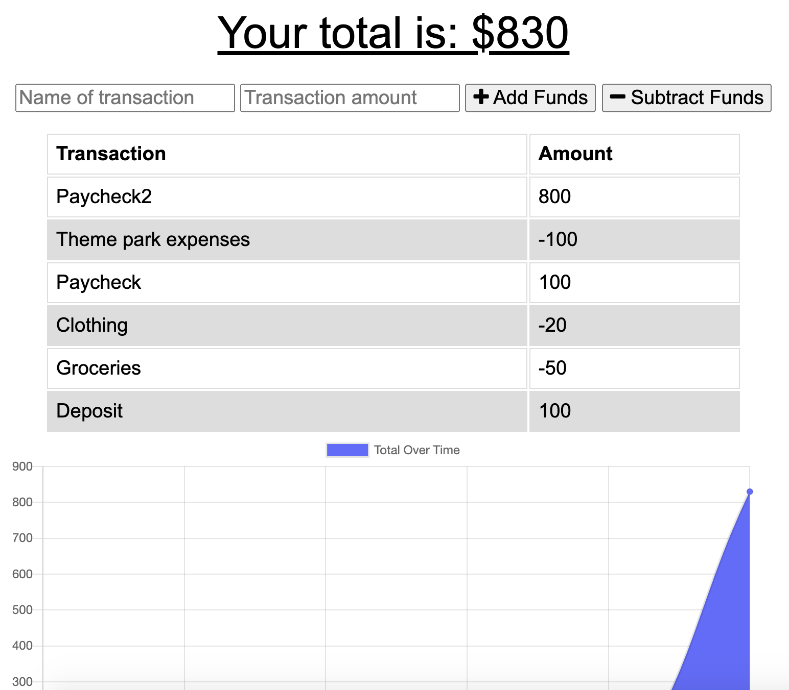
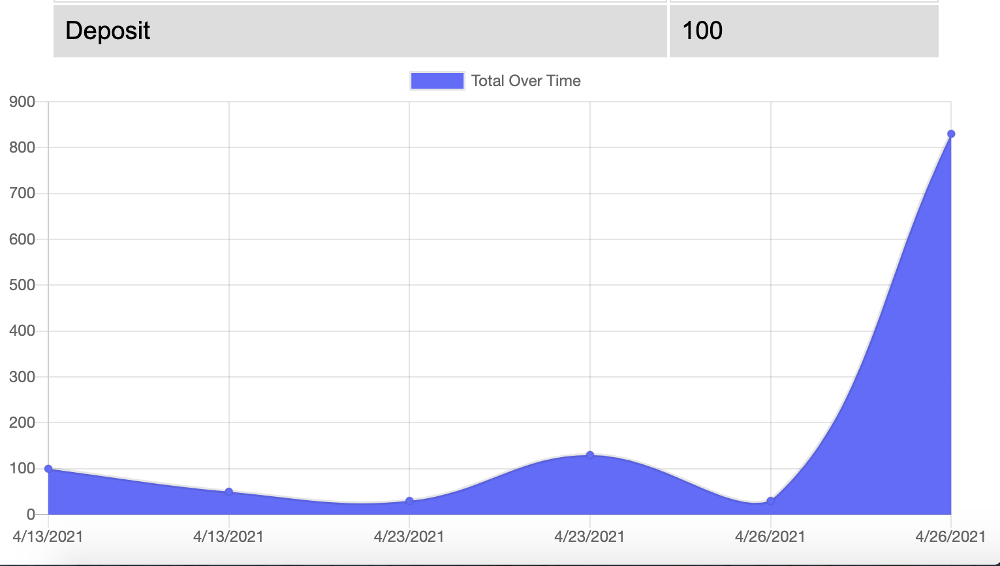

# Budget Tracker

## User Story

As and avid traveller, to be able to track my withdrawals and deposits with or without a data/internet connection, so that my account balance is accurate when I am traveling.

## Table of Content

* [Motivation](#motivation)
* [Description](#description)
* [Screenshots](#screenshots)
* [Link to Page](#link-to-page)

## Motivation

Giving users a fast and easy way to track their money is important, but allowing them to access that information anytime is even more important. Having offline functionality is paramount to our applications success.

## Description

Add functionality to our existing Budget Tracker application to allow for offline access and functionality.

The user will be able to add expenses and deposits to their budget with or without a connection. When entering transactions offline, they should populate the total when brought back online.

Offline Functionality:

  * Enter deposits offline

  * Enter expenses offline

When brought back online:

  * Offline entries should be added to tracker.

## Screenshots

## Link to Page

<>
